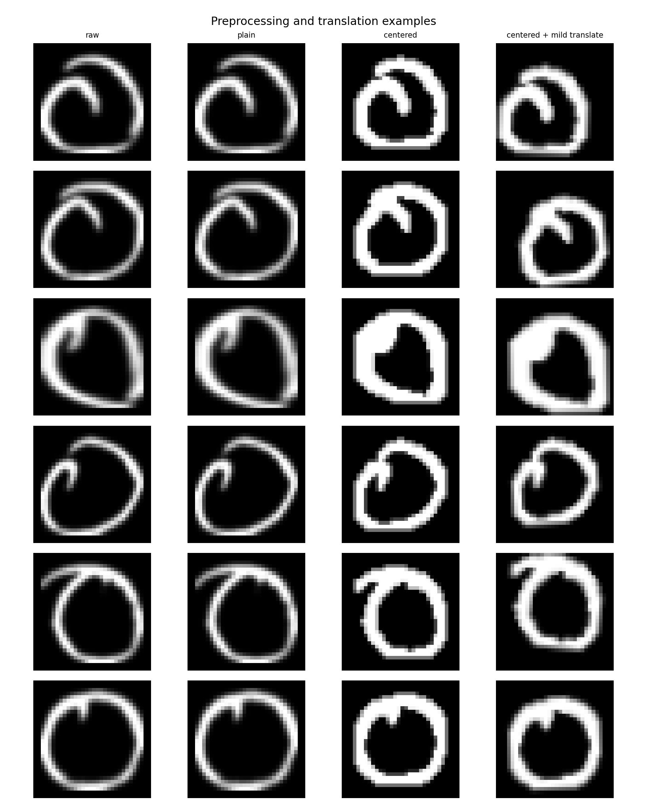
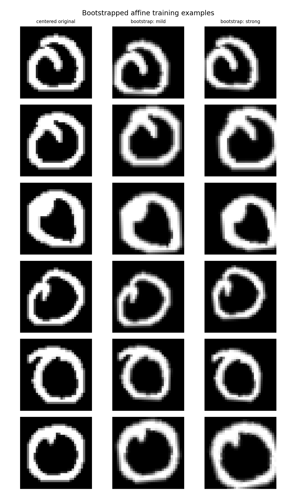
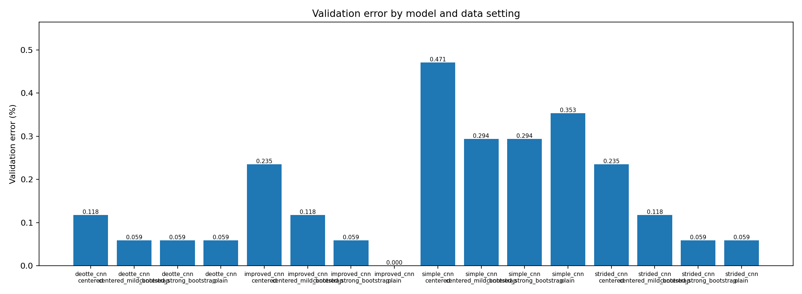
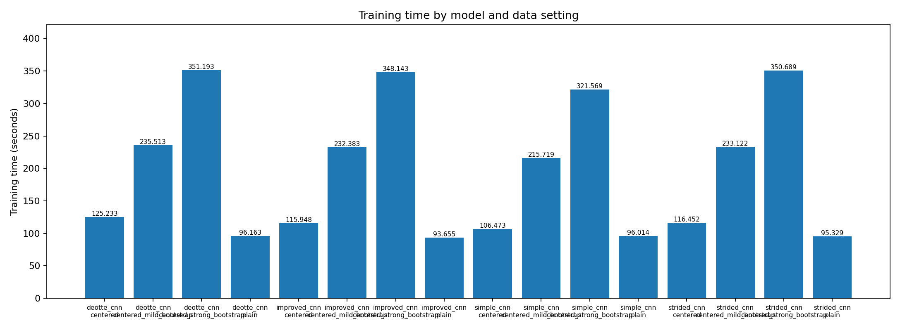
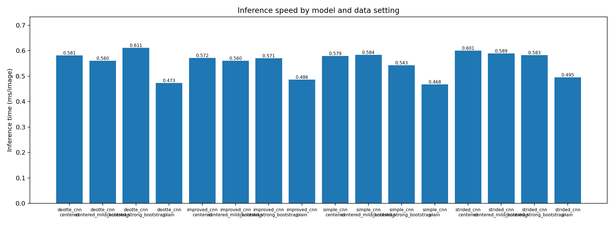
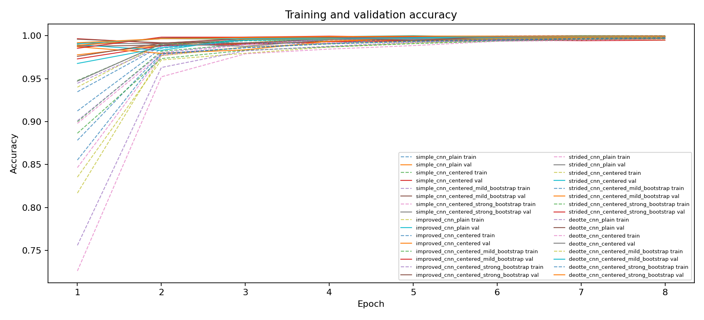
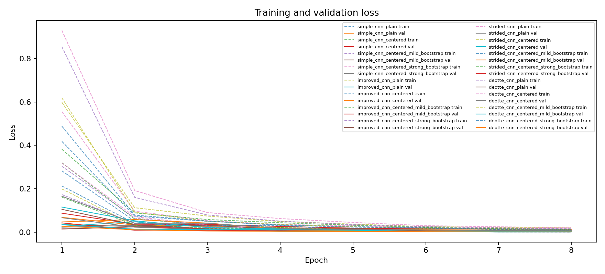
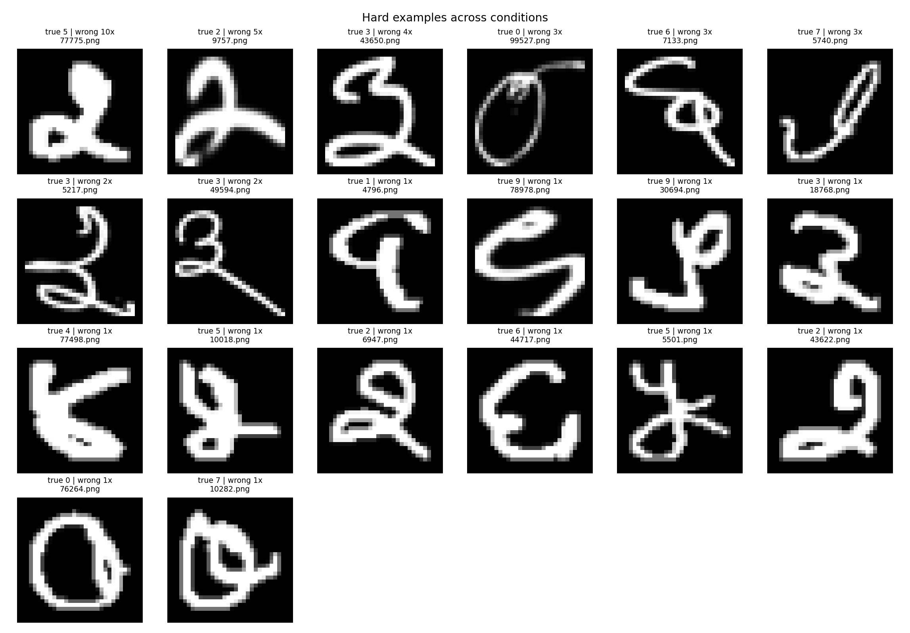

# Scientific Comparison of CNN Models and Preprocessing Strategies

## Research question
This experiment evaluates whether CNN architecture changes, foreground centering, and affine bootstrapping reduce validation error for binary digit classification.

## Experimental protocol
Training, evaluation, and reporting are separated into three scripts. `train_experiments.py` trains all configured conditions and saves checkpoints/training logs. `evaluate_experiments.py` loads those checkpoints and computes validation/inference statistics. `report.py` reads the saved outputs and generates this report. No command-line flags are required; all settings are in `config.py`.

## Assumptions
- The input images are treated as single-channel binary symbols: foreground shape carries the useful class information.
- The class label should not change under small translations, rotations, scale changes, or mild shear.
- Foreground centering is valid only if absolute position inside the 32x32 frame is not meaningful for the class label.
- Affine bootstrapping adds synthetic variants of existing images; it improves robustness but does not add independent new information.
- The affine ranges must remain bounded because aggressive transformations can create unrealistic or label-ambiguous digits.
- The stratified validation split is used as a proxy for hidden-test generalization, not as proof of universal model quality.
- Accuracy is the primary metric for single-label digit classification; macro F1 is reported to expose class-specific imbalance or failure.
- Training and inference timings are hardware-dependent and should only be compared between runs executed on the same machine.

## Model assumptions
- **simple_cnn**: Baseline CNN with two convolution-pooling stages and a dense classifier. It tests whether shallow local features are sufficient for the binary digit task.
- **improved_cnn**: Deeper CNN with Conv-BatchNorm-ReLU blocks, max-pooling, and dropout. It assumes extra capacity plus regularization can improve shape recognition without overfitting too strongly.
- **strided_cnn**: CNN with stride-2 convolution for learned downsampling. It assumes the model can learn better spatial reduction than fixed max-pooling alone.
- **deotte_cnn**: Compact MNIST-style CNN with repeated Conv-BatchNorm-ReLU blocks, learned downsampling, adaptive pooling, and dropout. It assumes several small convolution stages are useful for distorted handwritten-style symbols.

## Preprocessing and bootstrapping assumptions
- **plain**: Resize to the configured image size, convert to tensor, and normalize. This keeps the original location and scale information mostly intact.
- **centered**: Threshold the foreground, crop the non-background bounding box, pad to a square, resize, convert to tensor, and normalize. This treats translation and scale as nuisance variation.
- **affine `none`**: No synthetic affine samples are added. copies_per_original=0, degrees=0, translate=(0.0, 0.0), scale=(1.0, 1.0), shear=0.0.
- **affine `mild`**: Small random rotation, translation, and scale changes. Intended to preserve digit identity while improving robustness to alignment noise. copies_per_original=1, degrees=8, translate=(0.08, 0.08), scale=(0.92, 1.08), shear=0.0.
- **affine `strong`**: Larger affine perturbations including shear. Useful only if validation images contain strong distortion; otherwise it may create unrealistic samples. copies_per_original=2, degrees=14, translate=(0.12, 0.12), scale=(0.86, 1.16), shear=8.0.

The strong affine condition remains in the default report grid. It is useful as a stress test, but it should be accepted only if validation error improves; otherwise it is probably creating unrealistic samples.

## Configuration used
- Seed: `42`
- Epochs: `8`
- Batch size: `64`
- Optimizer: `adamw`
- Learning rate: `0.001`
- Weight decay: `0.0005`
- Scheduler: `cosine`
- Label smoothing: `0.0`

## Image examples
The preprocessing grid shows raw inputs, plain resizing, foreground centering, and a mild translated affine variant.

The bootstrap grid shows synthetic affine samples used during training. These samples are generated from existing labeled images, not from external data.

## Results summary
| model | data_setting | val_acc | val_error_percent | macro_f1 | training_seconds | inference_ms_per_image | train_samples | misclassified_count |
| --- | --- | --- | --- | --- | --- | --- | --- | --- |
| improved_cnn | plain | 1.0000 | 0.0000 | 1.0000 | 93.6554 | 0.4861 | 15300 | 0 |
| deotte_cnn | centered_mild_bootstrap | 0.9994 | 0.0588 | 0.9994 | 235.5127 | 0.5603 | 30600 | 1 |
| deotte_cnn | centered_strong_bootstrap | 0.9994 | 0.0588 | 0.9994 | 351.1931 | 0.6112 | 45900 | 1 |
| deotte_cnn | plain | 0.9994 | 0.0588 | 0.9994 | 96.1629 | 0.4728 | 15300 | 1 |
| improved_cnn | centered_strong_bootstrap | 0.9994 | 0.0588 | 0.9994 | 348.1435 | 0.5709 | 45900 | 1 |
| strided_cnn | centered_strong_bootstrap | 0.9994 | 0.0588 | 0.9994 | 350.6894 | 0.5825 | 45900 | 1 |
| strided_cnn | plain | 0.9994 | 0.0588 | 0.9994 | 95.3291 | 0.4952 | 15300 | 1 |
| deotte_cnn | centered | 0.9988 | 0.1176 | 0.9988 | 125.2330 | 0.5812 | 15300 | 2 |
| improved_cnn | centered_mild_bootstrap | 0.9988 | 0.1176 | 0.9988 | 232.3828 | 0.5603 | 30600 | 2 |
| strided_cnn | centered_mild_bootstrap | 0.9988 | 0.1176 | 0.9988 | 233.1222 | 0.5890 | 30600 | 2 |
| improved_cnn | centered | 0.9976 | 0.2353 | 0.9976 | 115.9482 | 0.5715 | 15300 | 4 |
| strided_cnn | centered | 0.9976 | 0.2353 | 0.9976 | 116.4520 | 0.6009 | 15300 | 4 |
| simple_cnn | centered_mild_bootstrap | 0.9971 | 0.2941 | 0.9971 | 215.7192 | 0.5844 | 30600 | 5 |
| simple_cnn | centered_strong_bootstrap | 0.9971 | 0.2941 | 0.9971 | 321.5689 | 0.5428 | 45900 | 5 |
| simple_cnn | plain | 0.9965 | 0.3529 | 0.9965 | 96.0137 | 0.4681 | 15300 | 6 |
| simple_cnn | centered | 0.9953 | 0.4706 | 0.9953 | 106.4731 | 0.5794 | 15300 | 8 |

## Graphs

## Best condition
The best validation condition is **improved_cnn_plain**, with validation accuracy `1.0000` and validation error `0.0000%`.

## Misclassification analysis
The first grid shows validation images misclassified by the best condition. The second grid shows hard examples that many conditions misclassified.

## Limitations
- A single validation split can overestimate or underestimate true generalization. Repeating the experiment over multiple seeds would strengthen the conclusion.
- Affine bootstrapping can help robustness, but strong settings can create samples that are no longer realistic digits.
- Timing measurements are machine-specific. They are useful for comparing these local runs, not for universal speed claims.
- The final model should be selected by validation performance and error inspection, not by architecture complexity alone.

## Files generated
- `training_summary.csv`: training statistics and checkpoint paths.
- `training_history.csv`: per-epoch losses and accuracies.
- `evaluation_summary.csv`: validation metrics, misclassification counts, and inference timing.
- `misclassified_examples.csv`: validation mistakes with image paths and predicted labels.
- `hard_examples.csv`: validation images missed by multiple conditions.